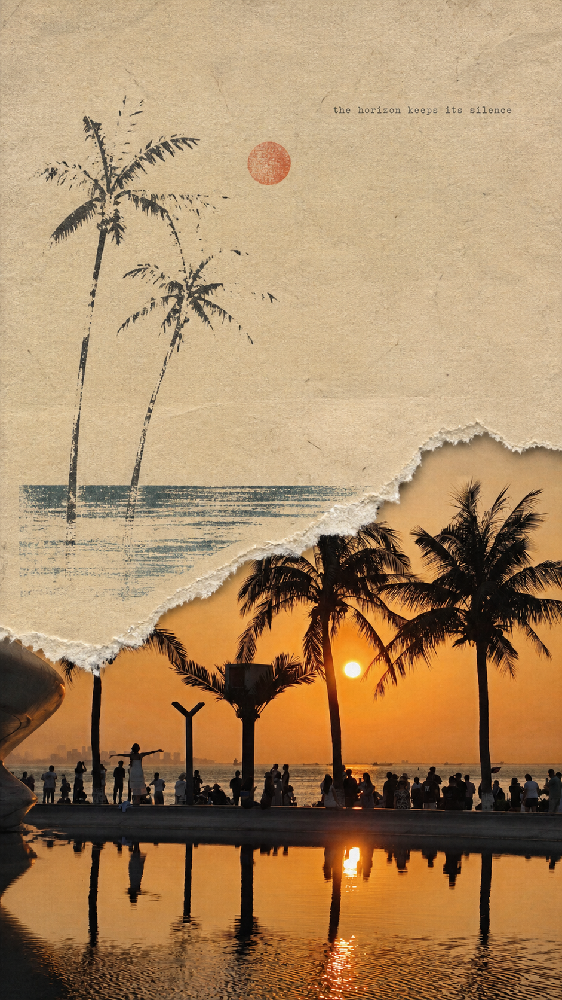

# Winter Picture Skill

把实拍照片制作成具有明确摄影保真区域的编辑艺术作品。当前提供两种同级风格模板：

1. **米白水墨二分明信片**：上半保留实拍照片，下半以低饱和水墨扁平插画回应原场景。
2. **复古撕纸丝网拼贴**：9:16 竖版，下半保留实拍，上半使用做旧手工纤维纸、偏侧撕裂缺口和粗颗粒丝网版画。

未指定风格时默认使用米白水墨模板；明确提到撕纸、做旧纸张、丝网版画或纪实拼贴时使用撕纸模板。

## 使用示例

- “用 Winter Picture Skill 把这张照片做成米白水墨明信片。”
- “使用复古撕纸丝网拼贴模板处理这张照片。”
- “为这组照片选择最适合的 Winter Picture Skill 模板。”

## 项目结构

```text
winter-picture-skill/
├── SKILL.md
├── agents/openai.yaml
├── references/
│   ├── template-ink-wash-postcard.md
│   ├── template-torn-paper-screenprint.md
│   └── examples.md
└── examples/
    ├── example-1.png ... example-5.png
    └── torn-paper-screenprint-sunset.png
```

## 模板示例

### 米白水墨二分明信片


### 复古撕纸丝网拼贴



## License

本项目仅供个人学习与使用，禁止商用。请勿将技能、提示词或生成结果用于商业用途。
